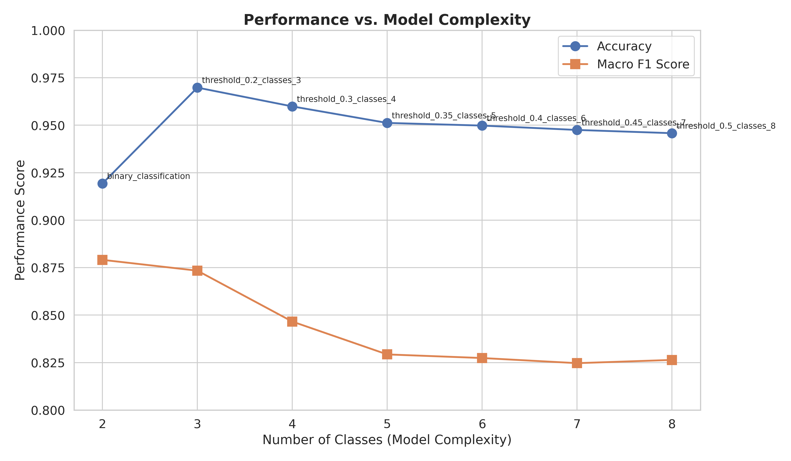
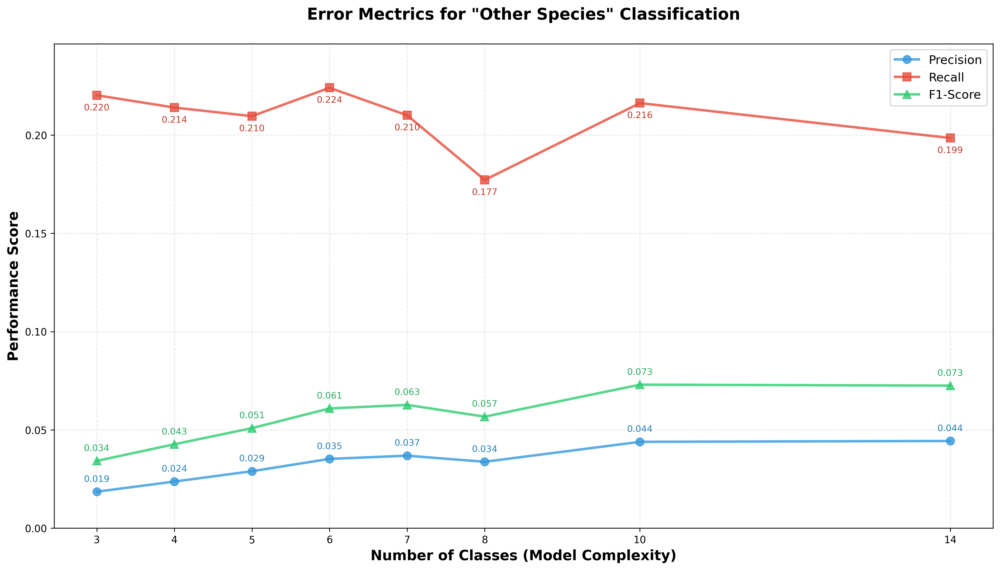
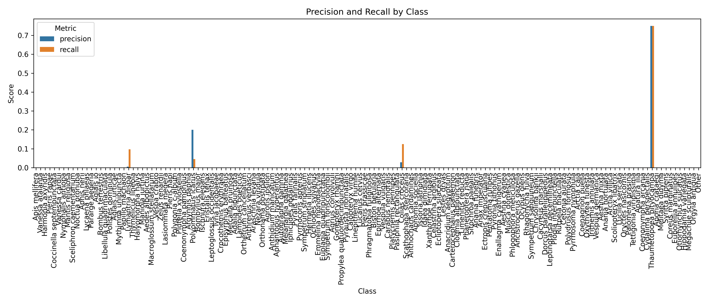

# TinyML with MCUNet

This is a fork of the MCUNet repository for utilizing TinyML to accelerate ML inferencing on Raspberry PI 4. This project aim to have multple MCUNet models act as cache to the bigger model for accelerating inferences.

## Acknowledgement

I would like to express my sincere gratitude to Professor [Daniel Hagimont](https://sd-160040.dedibox.fr/hagimont/) and Maître de Conférences [Camélia Slimani](https://scholar.google.com/citations?user=gfs36YEAAAAJ&hl=en) or their exceptional guidance and support throughout this project.
 Many to thanks to [Pham Xuan Hoang](https://hoangpham6337.github.io/portfolio/#projects) (aka Tom) for developing this wonderful training pipeline and the dataset exploration. 
 I am also grateful to ENSEiHT for providing me all the resources needed to complete this project   

## Overview

MCUNet is a framework designed to bring deep learning to IoT devices with extremely limited computing resources. This project extends MCUNet with additional tools for training, evaluation, and deployment of models for specific applications.

## Getting Started

### Prerequisites

* Python 3.8+ 
* CUDA-compatible GPU (optional, for faster training)
* At least 16GB RAM (I mean like c'mon you won't train it on a cheap laptop do ya? :D)
* git
* Virtual Environment (Yes anything is good as long as you don't pollute your environment. Conda is recommended)

### Installation

* Note: This implementation using conda virtual environment. You could also use the python virtual environment. 


1. Clone this repository:
```bash
git clone https://github.com/Spring317/tinyML.git
cd tinyML
```

2. Create and activate a conda environment:
```bash
   conda env create --name tinyml --file=environment.yml
   conda activate tinyml
```

* Note: This implementation will deploy the model to x86 device using onnx framework. If you wish to deploy the model on the micro-controler, please refer to [tinyengine](https://github.com/mit-han-lab/tinyengine) repo

## Training and validating:

1. Creating dataset:
```bash
# Please refer to this repo https://github.com/visipedia/inat_comp/tree/master/2017 if you having problem with the dataset
wget https://ml-inat-competition-datasets.s3.amazonaws.com/2017/train_val_images.tar.gz

tar -xvzf train_val_images.tar.gz
```  

2. Modify the config.yaml file to point to your data directory:
```yaml

global:
   # In this experiment, we only use the Insecta class from the iNaturalist dataset
   # Add more superclasses if you wish to use more classes
   included_classes: ["Insecta"]
   verbose: false
   overwrite: true

#Modify these paths to the dataset you want to use
paths:
   #path for the dataset you just downloaded (prefered to use the absolute path)
   #NOTE: If you are wish to train and test only 1 subclass like me, please point the src_dataset to the absolute path of the subclass you want to use
   src_dataset: "/absolute/path/to/your/data/then/your/subclass/that/you/want/to/use"
   #path for the sub-dataset you want to do training and validation (e.g. haute_garonne)
   dst_dataset: "/absolute/path/to/your/data/sub_dataset_or_sth_like_that"  

   #I am too lazy to change the path in the code, so I just put it here. Please don't touch it T.T
   web_crawl_output_json: "/home/quydx/iNaturelist_transfer_learning_pytorch/output/haute_garonne.json"
   output_dir: "/home/quydx/iNaturelist_transfer_learning_pytorch/output"

#In case you want to have more updated dataset, you can use the web_crawl to download the latest data from iNaturalist
#Else don't touch this part 
#UPDATE: I think the link is die so I am not sure if the web_crawl option is available. If yes then you are very lucky :D
web_crawl:
total_pages: 104
base_url: "https://www.inaturalist.org/check_lists/32961-Haute-Garonne-Check-List?page="
delay_between_requests: 1.0

#Modify these parameters to your needs
train_val_split:
train_size: 0.8
random_state: 42
dominant_threshold: 0.9
```
3. Before starting, let me explain to you what I am doing in this experiment.

* These repository is responsible for training every models used in [this repo](https://github.com/Spring317/iNaturelist_transfer_learning_pytorch) ,including tinymodel: fast and predict only a few classes of the dataset and the Convnext large: large model with precised predictions.

* For the tinymodel: 

  * This "few classes" is actually the classes with the most samples inside iNat2017 dataset, Insecta subset (for now)

  * According to Pareto principle (80/20 rule), I am only using 20% of the classes that cover 80% of the samples in the dataset since mcunet is having some problem with multiclass dataset (around 1500 or something like that?).

  * These models then will be piped  together to accelerate the training (Explaination and implementation are illustrated in [this repo](https://github.com/Spring317/iNaturelist_transfer_learning_pytorch)).

* For the last model (the largest model), it will act as a failsafe to handle the remaining classes (the one that those tinymodel failed to detect or not in the dection range of the tinymodel)

* Please run this command to kickstart the dataset preparation:
```bash
   python3 dataset_manifestation.py
```

4.  Great! Now you could start the training with very *Easy* command:
```bash
   python train.py --threshold 0.2 start_rank 0 #Feel free to change it to any value you want


```

5. Afterward you could make some *easy* validation based on the val.py script
```bash
   python3 eval.py
   #Add --help if you want to see the flags 
```

If you want to test with a large amount of models to find out which one has the best performance:
```bash
   python3 eval_multiple.py
```

6.  You are good to go! Now all you have to do is to quantize the model and deploy it on the Pi
```bash
   python3 quantize.py
```
*UPDATE: 

7.  For Deploying into Raspberry Pi 4b, please refer to the deployment repo [here](https://github.com/Spring317/mcunet-onnx-deploy)

<!-- ## Results: -->
<!-- ### Metrics: -->
<!---->
<!-- 1. Regular accuracy, recall, precision, F1-score for dominant classes -->
<!---->
<!-- 2. Error rate for others classes as follow: -->
<!---->
<!-- ### Modified Precision -->
<!-- $$\text{mod\_precision} = \begin{cases}  -->
<!-- \frac{FP}{TP + FP} & \text{if } (TP + FP) > 0 \\ -->
<!-- 0.0 & \text{otherwise} -->
<!-- \end{cases}$$ -->
<!---->
<!-- ### Modified Recall -->
<!-- $$\text{mod\_recall} = \begin{cases}  -->
<!-- \frac{FP}{FP + TN} & \text{if } (FP + TN) > 0 \\ -->
<!-- 0.0 & \text{otherwise} -->
<!-- \end{cases}$$ -->
<!---->
<!-- ### Modified F1-Score -->
<!-- $$\text{mod\_f1} = \begin{cases}  -->
<!-- \frac{2 \times \text{mod\_precision} \times \text{mod\_recall}}{\text{mod\_precision} + \text{mod\_recall}} & \text{if } (\text{mod\_precision} + \text{mod\_recall}) > 0 \\ -->
<!-- 0.0 & \text{otherwise} -->
<!-- \end{cases}$$ -->
<!---->
<!-- ### Where: -->
<!-- - $TP$ = True Positives -->
<!-- - $FP$ = False Positives   -->
<!-- - $TN$ = True Negatives -->
<!-- - $FN$ = False Negatives -->
<!---->
<!-- ### Note: -->
<!-- These modified metrics focus on tracking false positives (dominant classes misclassified as "Other Species") to measure the error rate when the model incorrectly predicts dominant species as others. -->
<!---->
<!-- ### Experimental setup: -->
<!---->
<!-- * Superclass: Insecta  -->
<!-- * Dominant classes: from 2 to 8 (14 in the error figure) classes (Cover 50% (65%) of the dominant species in the Insecta dataset) -->
<!-- * Epoch: 50 -->
<!-- * Batch size: 64 -->
<!-- * Learning read: 0.001 -->
<!-- * Number of worker: 8 -->
<!-- * Model type: mcunet-in2 -->
<!-- * Image size: 160x160 -->
<!---->
<!-- ### Results:  -->
<!---->
<!-- #### Accuracy and F1 scores of different classes setup -->
<!---->
<!--  -->
<!---->
<!-- #### My come-up metrics for others class (IDK if it correct). -->
<!--  -->

<!-- #### Precision and Recall by Class


<!-- #### Class Confidence Distribution
 -->


## References

### Papers
1. Lin, J., Chen, W. M., Lin, Y., Gan, C., & Han, S. (2020). [MCUNet: Tiny Deep Learning on IoT Devices](https://arxiv.org/abs/2007.10319). *Advances in Neural Information Processing Systems (NeurIPS)*.

2. Lin, J., Chen, W. M., Lin, Y., Coles, J., Critically, A., Chen, W., Chen, M., Zhang, M., Zhou, Y., Han, S. (2021). [MCUNetV2: Memory-Efficient Patch-based Inference for Tiny Deep Learning](https://arxiv.org/abs/2110.15352). *Advances in Neural Information Processing Systems (NeurIPS)*.

3. Lin, J., Chen, M., Zhang, M., Zhou, Y., & Han, S. (2022). [MCUNetV3: On-Device Training Under 256KB Memory](https://arxiv.org/abs/2206.15472). *Advances in Neural Information Processing Systems (NeurIPS)*.

4. Liberis, E., & Lane, N. D. (2021). [Neural networks on microcontrollers: saving memory at inference via operator reordering](https://arxiv.org/abs/2105.04209). *Conference on Machine Learning and Systems (MLSys)*.

### Code Repositories
1. [Original MCUNet Repository](https://github.com/mit-han-lab/mcunet) - The official implementation of MCUNet from MIT Han Lab.

2. [TinyEngine](https://github.com/mit-han-lab/tinyengine) - Optimized inference engine for microcontrollers.

3. [TF Micro](https://github.com/tensorflow/tflite-micro) - TensorFlow Lite for Microcontrollers.

4. [ONNX Runtime](https://github.com/microsoft/onnxruntime) - Cross-platform inference accelerator.

### Datasets
1. [iNaturalist 2017](https://github.com/visipedia/inat_comp/tree/master/2017) - Large-scale species classification dataset.
   
2. [iNaturalist Dataset Builder](https://github.com/HoangPham6337/iNaturelist_dataset_builder) - Dataset crawling and preprocessing. 

### Tutorials & Documentation
1. [TinyML: Machine Learning with TensorFlow Lite](https://www.tensorflow.org/lite/microcontrollers) - Official TensorFlow documentation for microcontroller deployment.

2. [ONNX Model Zoo](https://github.com/onnx/models) - Collection of pre-trained, state-of-the-art models in the ONNX format.

3. [PyTorch to ONNX Tutorial](https://pytorch.org/tutorials/advanced/super_resolution_with_onnxruntime.html) - Official PyTorch tutorial for ONNX export.

### Tools & Libraries
1. [ONNX Runtime Quantization](https://onnxruntime.ai/docs/performance/quantization.html) - Documentation for quantizing ONNX models.

2. [PyTorch Quantization](https://pytorch.org/docs/stable/quantization.html) - PyTorch's quantization support documentation.

3. [Raspberry Pi Documentation](https://www.raspberrypi.org/documentation/) - Official Raspberry Pi documentation.

## Citation

```
@article{lin2020mcunet,
  title={Mcunet: Tiny deep learning on iot devices},
  author={Lin, Ji and Chen, Wei-Ming and Lin, Yujun and Gan, Chuang and Han, Song},
  journal={Advances in Neural Information Processing Systems},
  volume={33},
  year={2020}
}

@inproceedings{
  lin2021mcunetv2,
  title={MCUNetV2: Memory-Efficient Patch-based Inference for Tiny Deep Learning},
  author={Lin, Ji and Chen, Wei-Ming and Cai, Han and Gan, Chuang and Han, Song},
  booktitle={Annual Conference on Neural Information Processing Systems (NeurIPS)},
  year={2021}
} 

@article{
  lin2022ondevice, 
  title = {On-Device Training Under 256KB Memory},
  author = {Lin, Ji and Zhu, Ligeng and Chen, Wei-Ming and Wang, Wei-Chen and Gan, Chuang and Han, Song}, 
  journal = {arXiv:2206.15472 [cs]},
  url = {https://arxiv.org/abs/2206.15472},
  year = {2022}
}
```
